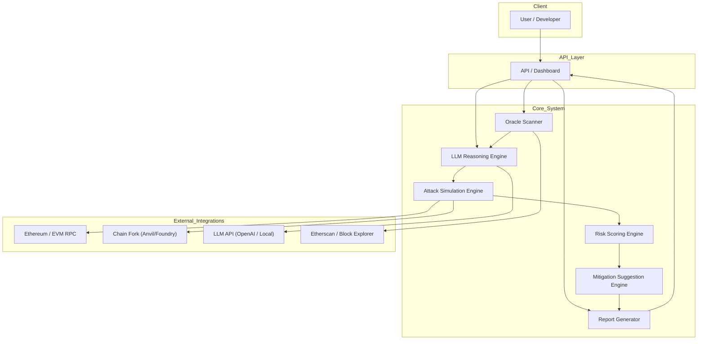
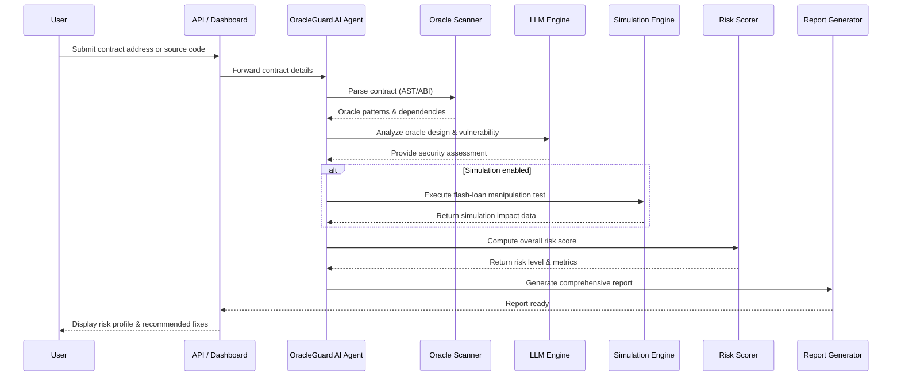

# OracleGuard AI – Architecture Design

## 🚀 Overview

OracleGuard AI is an AI-powered platform built to **detect**, **analyze**, **simulate**, and **mitigate** oracle manipulation risks in DeFi smart contracts. Inspired by the **UwU Lend exploit (June 2024)**—a flash-loan attack that artificially inflated CRV prices and led to a ~$19.5 M loss—OracleGuard AI combines static analysis, AI reasoning, and on-chain simulation to help developers and auditors catch and remediate weak oracle designs **before** they can be exploited.

---

## 🏛️ System Architecture

Below is a high-level component diagram illustrating how **User**, **API**, **Core Modules**, and **External Integrations** collaborate to produce risk reports and recommendations.

## End-to-end interaction
The end-to-end interaction from contract submission to report delivery, emphasizing the role of each core module.
